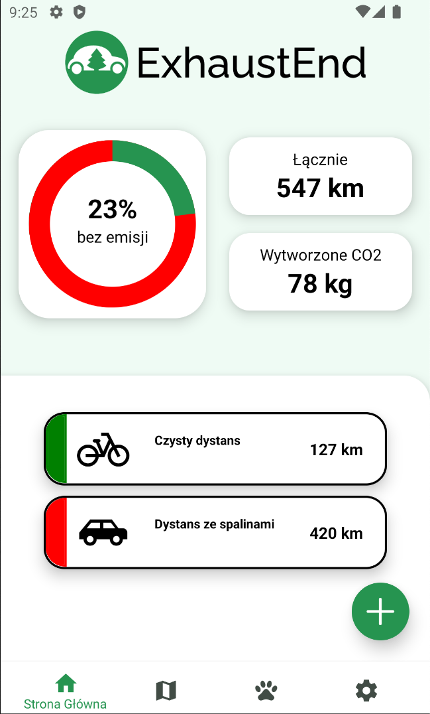
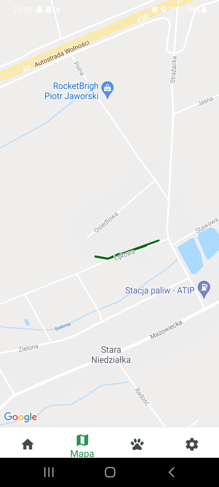

  <h1> ExhaustEnd</h1>

Aplikacja stworzona w ramach konkursu [MINI HACKATHON – EDYCJA I](https://nowaakademia.org/mini-hackathon-edycja-i/) przez:
- Kaspra Gaworskiego
- Kacpra Królaka
- Kacpra Szczęsnego

Celem aplikacji jest uświadamianie użytkowników, jak wiele dwutlenku węgla emitują podczas poruszania się pojazdami spalinowymi. 

Program na mapie zaznacza odcinki pokonane w sposób bezemisyjny i emisyjny, pokazuje ich długość, a także w przystępny sposób pokazuje ilość wydalanego przez nas dwutlenku węgla.

Funkcjonalność aplikacji jest oparta na sensorach ruchu w urządzeniu mobilnym

  

  <table>
    <tr>
      <td width="33%">
        
      </td>
      <td width="33%">
        
      </td>
    </tr>
  </table>

Aplikacja została napisana przy użyciu [React Native](http://www.reactnative.com). 
Używa bazy danych [SQLite](https://sqlite.org/index.html), a także [Map Google](https://developers.google.com/maps/documentation/android-sdk/overview) i geolokalizacji.

## Instalacja 
1. Pobrać plik .apk na telefon z systemem Android z [tego linku](https://mega.nz/file/1C5gAITD#pCDlME0V1aCVKHiJr1c836D8n7kEnKkOLND1hYvCV-w)
2. Wejść w Play Store -> Ustawienia profilu (Prawy górny róg) -> Play Protect -> Wyłącz na czas instalacji aplikacji
3. Otworzyć plik .apk i zgodzić się na wszystkie opcje wyboru proponowane przez instalator
4. Po instalacji wejść w systemowe ustawienia aplikacji (Przytrzymać ikonę zainstalowanej aplikacji i wejść w informacje) -> Wejść w Uprawnienia i zezwolić na wszystkie wymagane uprawnienia

---
## Struktura projektu

* ❗📄 `App.js`: Główny plik aplikacji.

* 📁 `components`: Zawiera mniejsze elementy aplikacji.
  * ❗📄 `components/Footer.js`: Nakładka zarządzająca zakładkami oraz bazą danych:
  * 📄 `components/CharityCard.js`: Obiekt pokazujący zbiórkę charytatywną.
  * 📄 `components/colors.js`: Kolory użyte w aplikacji.
  * 📄 `components/EmissionMarker.js`: Wykres kołowy.
  * 📄 `components/ActivityModule.js`: Prostokąt z tekstem.
  * 📄 `components/HomePageModule.js`: Odpowiada za podsumowanie na stronie głownej.
  * 📄 `components/NewActivityButton.js`: Przycisk dodawania aktywności (Nie zdążyliśmy dodać funkcjonalności).

* 📁 `tabs`: Zawiera zakładki aplikacji.
  * ❗📄 `tabs/Home.js`: Zawiera podsumowanie przebytego dystansu i emisji
  * ❗📄 `tabs/Statistics.js`: Pokazuje na mapie ostatnie aktywności.
  * ❗📄 `tabs/Charity.js`: Lista zbiórek charytatywnych.
  * ❗📄 `tabs/Settings.js`: Lista zbiórek charytatywnych.
